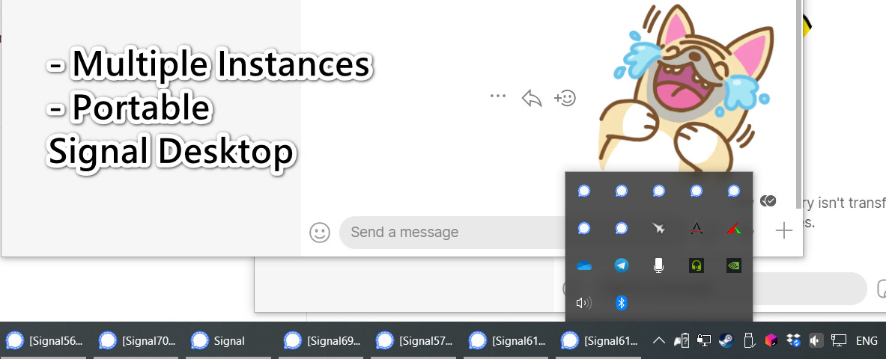

# Signal-Desktop-Multiple-Portable

[⚠️Unmaintained: As the upstream keeps changing, it is hard to merge the code]



## What is it?

It is a modified Signal Desktop using the official source code, but with:

* Multiple instances, multiple accounts
* Portable
* Enable Tray Icon by default

Currently, I build for Windows only.

## Motivation
I need to use multiple signal numbers at the same time in a PC. However, there is no way to do that currently. So I decided to modify it.

## Download

* <a href="https://github.com/louislam/Signal-Desktop-Multiple-Portable/releases/download/5.4.1/signal-desktop-win-5.4.1.zip">5.4.1.zip (Windows)</a> (2021-06-15)
* <a href="https://github.com/louislam/Signal-Desktop-Multiple-Portable/releases/download/v5.0.0-mp1/signal-desktop-win-5.0.0-mp1.zip">5.0.0-mp1.zip (Windows)</a>
* <a href="https://github.com/louislam/Signal-Desktop-Multiple-Portable/releases/download/v1.40.1-mp1/signal-desktop-win-1.40.1-mp1.zip">1.40.1-mp1.zip (Windows)</a>


## How to use

In the app folder, by default, there are two bat files for 2 profiles:
* SignalProfile1.bat
* SignalProfile2.bat

If you need more profiles, 
1. copy SignalProfile1.bat, rename it
1. open it with any text editor
1. change "profile1" to another name

```
@echo off
Start Signal.exe --profile <Your Profile Name>
```

The profiles are located in:

```
./profiles
```

## How to Update?

1. close all running instances
1. move your ./profiles and .bat files to the newer version folder
1. that's it

## Original README

https://github.com/signalapp/Signal-Desktop


## [For me] Merge Update from Upstream

1. git fetch official
1. git merge official/master
1. npm run clean-transpile
1. npm run clean-protobuf   (rm command is not working in Windows, remove the files manually)
1. npm run build-protobuf
1. npm run transpile
1. npm run build:dev   
1. npm run start

